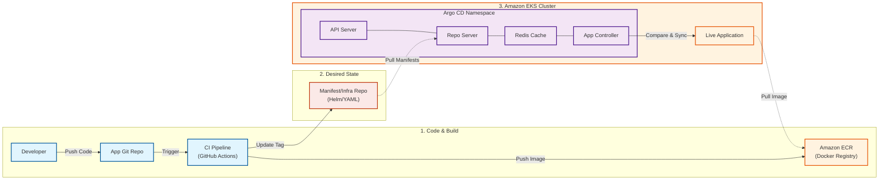
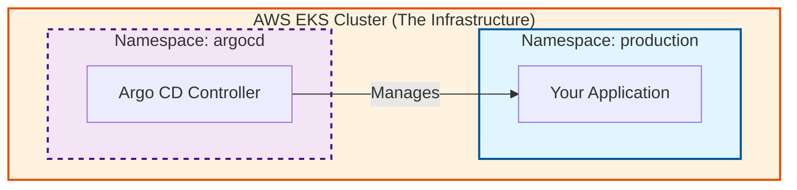

This is **excellent**. You have gone from a "beginner" understanding to a "professional" architectural view. The text you provided is exactly how a Senior DevOps Engineer would describe it.

Yes, you should definitely use this version. It shows you understand the **entire lifecycle** (CI + CD), not just the final step.

Here is the updated diagram code representing exactly the workflow you described, including the **CI steps**, **ECR**, and the **Argo CD internals**.

### The "Full Picture" Diagram (CI + CD + Internals)

This diagram visualizes your text step-by-step.

### How to Explain the "Core Components" (If asked)

Since you listed the components (API, Repo Server, etc.), your manager might point to them and ask "What does this one do?" Here is your simple "Cheat Sheet" for those specific boxes:

1. **Repository Server:** "This is the reader. It clones the Git repo and reads the YAML/Helm files so Argo understands them."
2. **Application Controller:** "This is the brain. It runs the loop that compares 'What we want' (Git) vs. 'What we have' (EKS) and fixes differences."
3. **Redis:** "This is just the memory cache. It stores data temporarily so Argo doesn't have to spam GitHub with requests every millisecond."
4. **API Server:** "This is the face. It powers the web UI we look at and the CLI we type commands into."

### One "Pro-Tip" for your presentation

You mentioned distinct repositories: **Application Repo** vs. **Infrastructure/Manifest Repo**.

* **Why this is smart:** Tell your manager, *"I separated the App Code from the Manifests in the diagram because it prevents infinite loops in the CI pipeline and is a security best practice."*
* (This will make you sound very experienced).

You are ready. This diagram covers every point your manager asked for. Good luck!

To be crystal clear: **Argo CD sits INSIDE your EKS Cluster.**

It is not a website running on someone's laptop or a separate cloud server. It is a set of "Pods" (containers) running directly on the same infrastructure as your application.

### 1. Where is it in the diagram?

In the Mermaid code I gave you above, look at **Section 3**.

* **The Outer Box:** `subgraph EKS ["3. Amazon EKS Cluster"]`
* **The Inner Box:** `subgraph ArgoCore ["Argo CD Namespace"]`

**The "Visual Proof":** Because the `ArgoCore` box is **inside** the `EKS` box, that tells any engineer: *"This software is installed on the cluster itself."*

### 2. What to say to your Manager

If they ask, *"Where is Argo actually running?"*, use this answer to sound professional:

> "Argo CD is installed **in-cluster**. It runs in its own namespace (usually called `argocd`) within our EKS cluster. This allows it to communicate directly with the Kubernetes API to manage our deployments securely, without needing external access keys."

### 3. Diagram Highlight

Here is a zoomed-in view of just that part so you can see the relationship clearly.

**Key Takeaway for you:**
Think of Argo CD like a **maintenance robot** that lives inside the factory (EKS). It doesn't commute to work; it lives there so it can fix things immediately.
