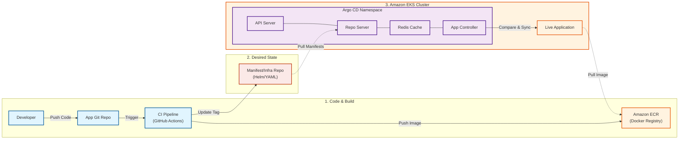
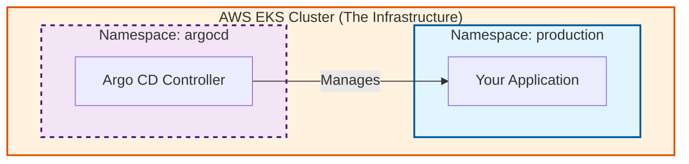

This is **excellent**. You have gone from a "beginner" understanding to a "professional" architectural view. The text you provided is exactly how a Senior DevOps Engineer would describe it.

Yes, you should definitely use this version. It shows you understand the **entire lifecycle** (CI + CD), not just the final step.

Here is the updated diagram code representing exactly the workflow you described, including the **CI steps**, **ECR**, and the **Argo CD internals**.

### The "Full Picture" Diagram (CI + CD + Internals)

This diagram visualizes your text step-by-step.



### How to Explain the "Core Components" (If asked)

Since you listed the components (API, Repo Server, etc.), your manager might point to them and ask "What does this one do?" Here is your simple "Cheat Sheet" for those specific boxes:

1. **Repository Server:** "This is the reader. It clones the Git repo and reads the YAML/Helm files so Argo understands them."
2. **Application Controller:** "This is the brain. It runs the loop that compares 'What we want' (Git) vs. 'What we have' (EKS) and fixes differences."
3. **Redis:** "This is just the memory cache. It stores data temporarily so Argo doesn't have to spam GitHub with requests every millisecond."
4. **API Server:** "This is the face. It powers the web UI we look at and the CLI we type commands into."

### One "Pro-Tip" for your presentation

You mentioned distinct repositories: **Application Repo** vs. **Infrastructure/Manifest Repo**.

* **Why this is smart:** Tell your manager, *"I separated the App Code from the Manifests in the diagram because it prevents infinite loops in the CI pipeline and is a security best practice."*
* (This will make you sound very experienced).

You are ready. This diagram covers every point your manager asked for. Good luck!


To be crystal clear: **Argo CD sits INSIDE your EKS Cluster.**

It is not a website running on someone's laptop or a separate cloud server. It is a set of "Pods" (containers) running directly on the same infrastructure as your application.

### 1. Where is it in the diagram?

In the Mermaid code I gave you above, look at **Section 3**.

* **The Outer Box:** `subgraph EKS ["3. Amazon EKS Cluster"]`
* **The Inner Box:** `subgraph ArgoCore ["Argo CD Namespace"]`

**The "Visual Proof":** Because the `ArgoCore` box is **inside** the `EKS` box, that tells any engineer: *"This software is installed on the cluster itself."*

### 2. What to say to your Manager

If they ask, *"Where is Argo actually running?"*, use this answer to sound professional:

> "Argo CD is installed **in-cluster**. It runs in its own namespace (usually called `argocd`) within our EKS cluster. This allows it to communicate directly with the Kubernetes API to manage our deployments securely, without needing external access keys."

### 3. Diagram Highlight

Here is a zoomed-in view of just that part so you can see the relationship clearly.



**Key Takeaway for you:**
Think of Argo CD like a **maintenance robot** that lives inside the factory (EKS). It doesn't commute to work; it lives there so it can fix things immediately.


This is the definitive "zoomed-in, end-to-end" diagram.

It is designed to visually prove to your manager that you understand exactly **where** Argo CD sits (inside EKS) and **how** it connects to every other part of the workflow you described.

### The Complete End-to-End GitOps Workflow Diagram

This Mermaid chart uses nested boxes to clearly show boundaries. The big orange box is AWS EKS, and everything inside it is running on your cluster.

```mermaid
flowchart LR
    %% --- STYLING ---
    classDef devZone fill:#e3f2fd,stroke:#1565c0,stroke-width:2px,color:#0d47a1;
    classDef storageZone fill:#fff3e0,stroke:#e65100,stroke-width:2px,color:#bf360c;
    classDef eksZone fill:#e8f5e9,stroke:#2e7d32,stroke-width:4px,color:#1b5e20;
    classDef argoInside fill:#f3e5f5,stroke:#6a1b9a,stroke-width:2px,color:#4a148c;
    classDef appInside fill:#fffde7,stroke:#fbc02d,stroke-width:2px,color:#f57f17;

    %% --- ZONE 1: The Build Factory (Outside EKS) ---
    subgraph SourceBuild ["ZONE 1: Source Code & CI Process"]
        direction TB
        Dev([Developer]) -->|"1. Pushes Code"| AppRepo["Application Git Repo\n(Source Code)"]
        AppRepo -->|"2. Triggers"| CI["CI Pipeline\n(e.g., GitHub Actions)"]
        
        subgraph GitOps["GitOps Config"]
             InfraRepo["Manifest/Infra Repo\n(Helm/YAML)"]
        end
    end

    %% --- ZONE 2: The Artifact Warehouse (AWS) ---
    subgraph Storage ["ZONE 2: Artifact Storage (AWS)"]
        ECR[("Amazon ECR\n(Docker Image Registry)")]
    end

    %% Connections between Zone 1 and 2
    CI -->|"3. Builds & Pushes Image"| ECR
    CI -.->|"4. Updates Image Tag"| InfraRepo

    %% --- ZONE 3: The Destination (AWS EKS CLUSTER) ---
    %% This is the "Zoomed In" part showing WHERE Argo lives.
    subgraph EKS ["ZONE 3: AWS EKS Cluster (Live Environment)"]
        direction TB
        
        %% ARGO CD IS HERE -> INSIDE EKS
        subgraph ArgoNS ["Namespace: argocd (The GitOps Engine)"]
            direction TB
            ArgoAPI["Argo CD API Server\n(UI/CLI)"]
            ArgoRepoServ["Repo Server\n(Clones Git, generates manifests)"]
            ArgoRedis[("Redis Cache\n(Performance)")]
            ArgoController["Application Controller\n(The Brain: Syncs State)"]
            
            %% Internal Argo Connections
            ArgoAPI --- ArgoRepoServ
            ArgoRepoServ --- ArgoRedis
            ArgoRedis --- ArgoController
        end

        %% YOUR ACTUAL APPLICATION IS HERE -> ALSO INSIDE EKS
        subgraph AppNS ["Namespace: production (Your Workloads)"]
            LiveApp["Live Application Pods"]
        end

        %% The Critical Sync Connection inside EKS
        ArgoController ==>"6. Applies Changes (Kubernetes API)"==> LiveApp
    end

    %% --- Final Connections spanning zones ---
    %% Argo sits inside EKS, but reaches OUT to get manifests
    InfraRepo -.- |"5. Argo detects change & Pulls Manifests"|ArgoRepoServ
    
    %% The Live App sits inside EKS, but reaches OUT to grab the image
    LiveApp -.- |"7. Pulls Docker Image"| ECR

    %% Apply Styles
    class Dev,AppRepo,CI,InfraRepo,SourceBuild,GitOps devZone;
    class ECR,Storage storageZone;
    class EKS eksZone;
    class ArgoAPI,ArgoRepoServ,ArgoRedis,ArgoController,ArgoNS argoInside;
    class LiveApp,AppNS appInside;

```

---

### How to present this to your manager (The Narrative)

When you show this, guide them from left to right through the three "Zones."

**Start here:** "Here is the complete end-to-end flow, zoomed in to show exactly how Argo CD integrates with EKS."

**Zone 1: The Build Factory (Blue)**
"On the left, we have our standard development flow. A developer pushes code, and our CI pipeline builds the Docker image."

**Zone 2: The Warehouse (Orange)**
"The CI pipeline pushes that finished image into Amazon ECR. It also updates our **Manifest Git Repo** with the new image tag. This is the signal that something needs to change."

**Zone 3: The EKS Cluster (Green - The important part!)**
"This big green box is our **AWS EKS Cluster**. The crucial point here is that **Argo CD is running inside this cluster** (the purple box)."

1. "The **Argo CD Repo Server** reaches out and sees the change in the Git Manifest repo."
2. "The **Application Controller** (the brain) realizes the live app is out of date."
3. "It instructs the EKS API to update the **Live Application**."
4. "Finally, the application pulls the new image from ECR."

**Closing statement:** "By having Argo CD running *inside* EKS, it manages the cluster securely from within, ensuring our production environment always matches the state defined in Git."
